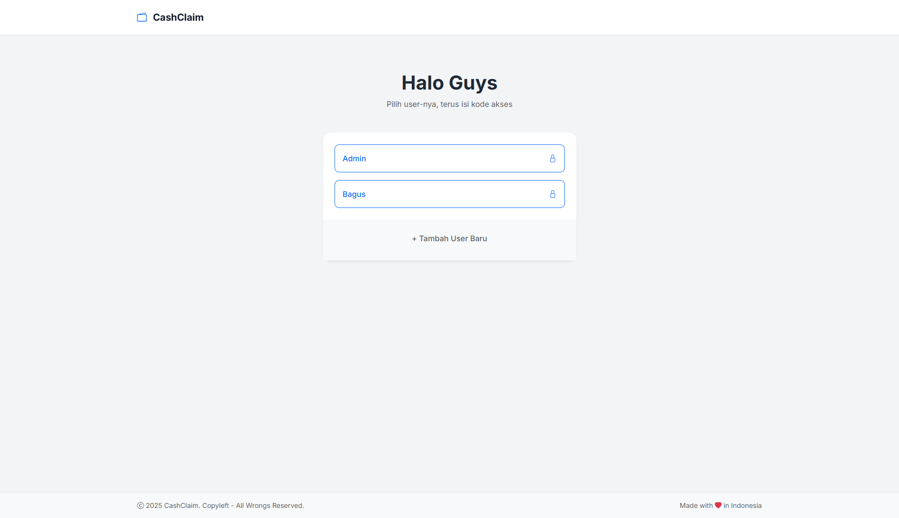
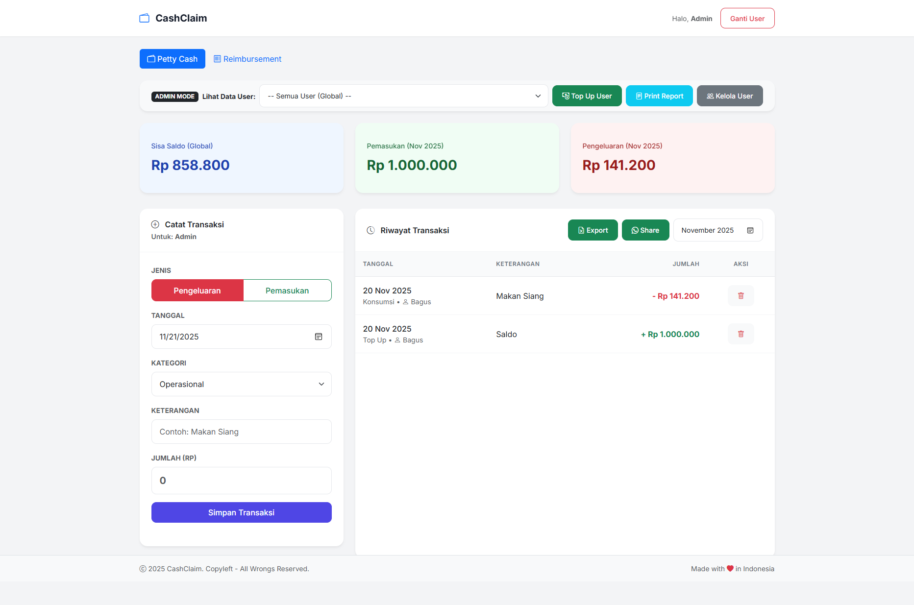

# CashClaim

Aplikasi manajemen keuangan yang simpel buat tracking petty cash sama reimbursement. Dibangun pakai pure native PHP dan SQLite, cocok banget buat tim kecil sampai menengah.

## Apa Itu CashClaim?

CashClaim punya dua modul utama:

- **Petty Cash**: Catat pemasukan dan pengeluaran dengan kalkulasi saldo real-time
- **Reimbursement**: Ajukan dan approve request reimbursement dengan workflow yang rapi

## Screenshots

### Halaman Login



### Dashboard



## Stack Teknologi

### Backend

- **PHP 7.4+**: Pure native PHP tanpa framework ribet
- **SQLite 3**: Database ringan berbasis file
- **PDO**: Database abstraction layer buat query yang aman

### Frontend

- **HTML5**: Markup semantik
- **CSS3**: Custom styling dengan desain modern
- **Bootstrap 5.3.0**: Framework UI responsive (via CDN)
- **Bootstrap Icons 1.11.0**: Library icon (via CDN)
- **JavaScript (Vanilla)**: Interaksi client-side, tanpa framework
- **Google Fonts (Inter)**: Typography kece

## Fitur-Fitur Keren

### User Management

- Sistem autentikasi pakai PIN
- Role-based access control (Admin dan User)
- Buat dan kelola user
- Ganti-ganti access code sesuka hati

### Modul Petty Cash

- Catat transaksi pemasukan dan pengeluaran
- Kalkulasi saldo real-time
- Ringkasan transaksi bulanan
- Organisir berdasarkan kategori
- History transaksi dengan filter
- Export ke CSV
- Share laporan via WhatsApp
- Laporan siap print

### Modul Reimbursement

- Submit request reimbursement
- Workflow approval (Pending, Approved, Rejected, Paid)
- Admin bisa approve/reject dengan catatan
- Tracking status dan history
- Terpisah dari petty cash (ga ngaruh ke saldo)

### Fitur Admin

- Lihat data semua user sekaligus
- Filter data per user
- Top-up saldo user
- Approve/reject request reimbursement
- Laporan lengkap
- Kelola user (tambah, hapus, ganti access code)

### Laporan dan Export

- Generate laporan siap print
- Export ke CSV
- Integrasi share WhatsApp
- Filter per bulan
- Laporan per user

## Struktur File

```
pettycash/
├── config.php             # Konfigurasi aplikasi (URL mode, database, dll)
├── db.php                 # Koneksi database dan schema
├── index.php              # Halaman login
├── dashboard.php          # Aplikasi utama (tab Petty Cash & Reimbursement)
├── process.php            # Handler transaksi petty cash
├── reimbursement.php      # Handler request reimbursement
├── users.php              # Kelola user (Admin only)
├── report.php             # Halaman laporan siap print
├── header.php             # Header dan navigasi
├── footer.php             # Footer dan scripts
├── assets/
│   ├── css/
│   │   └── app.css        # Custom styles
│   └── js/
│       └── app.js         # Custom scripts
├── pettycash.db           # File database SQLite (auto-created)
└── LICENSE                # MIT License
```

## Schema Database

### Tabel

#### `expenses`

- `id`: Primary key
- `date`: Tanggal transaksi
- `description`: Deskripsi transaksi
- `category`: Kategori transaksi
- `amount`: Jumlah transaksi (integer)
- `type`: 'income' atau 'expense'
- `user`: User terkait
- `created_at`: Timestamp

#### `users`

- `id`: Primary key
- `name`: Username (unique)
- `access_code`: PIN buat autentikasi

#### `reimbursements`

- `id`: Primary key
- `user`: User yang request
- `date`: Tanggal reimbursement
- `category`: Kategori pengeluaran
- `description`: Deskripsi pengeluaran
- `amount`: Jumlah reimbursement
- `status`: 'pending', 'approved', 'rejected', atau 'paid'
- `notes`: Catatan admin atau alasan reject
- `submitted_at`: Waktu submit
- `processed_at`: Waktu diproses
- `processed_by`: Admin yang proses

## Cara Install

### Requirement

- PHP 7.4 atau lebih baru
- SQLite 3 extension harus aktif
- Web server (Apache, Nginx, atau PHP built-in server)

### Langkah-Langkah Setup

1. Clone atau download project ke web directory kamu

2. Pastikan PHP SQLite extension aktif:

   ```bash
   php -m | grep sqlite
   ```

3. Set permission yang bener buat file database:

   ```bash
   chmod 664 pettycash.db
   chmod 775 .
   ```

4. Jalanin aplikasinya:

   **Pakai PHP built-in server:**

   ```bash
   php -S localhost:8000
   ```

   **Pakai Apache/Nginx:**
   Konfigurasi virtual host kamu buat nunjuk ke directory project

5. Akses aplikasinya:

   ```
   http://localhost:8000
   ```

6. Login default admin:
   - Username: Admin
   - Access Code: 1234

## Cara Pakai

### Setup Pertama Kali

1. Login pakai kredensial Admin default (Admin / 1234)
2. Ganti access code Admin di menu "Kelola User"
3. Bikin user tambahan sesuai kebutuhan

### Buat User Biasa

1. Pilih nama kamu di halaman login
2. Masukin access code
3. Pakai tab Petty Cash buat catat transaksi
4. Pakai tab Reimbursement buat submit request
5. Lihat history transaksi dan status reimbursement kamu

### Buat Admin

1. Login pakai kredensial Admin
2. Akses semua fitur di kedua modul
3. Filter data per user atau lihat statistik global
4. Approve/reject request reimbursement
5. Top-up saldo user
6. Generate dan print laporan
7. Kelola user dan access code

## Catatan Keamanan

- Access code disimpan plain text (consider hashing buat production)
- File database jangan bisa diakses via web (pakai .htaccess atau nginx config)
- Input sanitization via PDO prepared statements
- Autentikasi berbasis session
- Role-based access control di-enforce server-side

## Konfigurasi

### Clean URL Mode

Edit `config.php` buat toggle URL dengan/tanpa `.php` extension:

```php
// true = URL tanpa .php (butuh web server config)
// false = URL dengan .php (langsung jalan)
define('CLEAN_URL', true);
```

Lihat `URL_CONFIG.md` untuk detail lengkap.

### Lokasi Database

Edit `config.php` buat ganti lokasi file database:

```php
define('DB_FILE', __DIR__ . '/pettycash.db');
```

### Default Access Code

Edit `config.php` buat ganti PIN default:

```php
define('DEFAULT_ADMIN_PIN', '1234');
```

## Kompatibilitas Browser

- Chrome 90+
- Firefox 88+
- Safari 14+
- Edge 90+

## License

MIT License - lihat file [LICENSE](LICENSE) untuk detail lengkap

## Credits

Made with love in Indonesia by [Bagus Setya](https://github.com/bgustyp)
